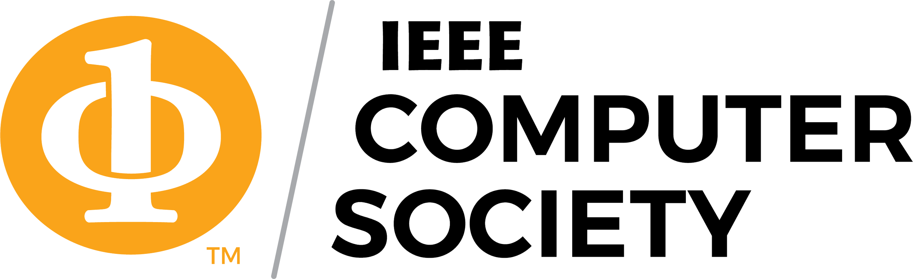

# IEEE Computer Society PUCV - Landing Page



Landing page oficial del Capítulo Estudiantil de **IEEE Computer Society** en la Pontificia Universidad Católica de Valparaíso (PUCV).

## 🚀 Demo

Abre el proyecto localmente:

```bash
npm run dev
```

Visita `http://localhost:4321`

## 📦 Stack Tecnológico

| Tecnología | Versión | Descripción |
|------------|---------|-------------|
| [Astro](https://astro.build) | 5.x | Framework SSG (Static Site Generation) |
| [Tailwind CSS](https://tailwindcss.com) | 4.x | Utilidades CSS |
| [React](https://react.dev) | 19.x | Componentes interactivos (cuando sea necesario) |
| [TypeScript](https://www.typescriptlang.org) | strict | Tipado estático |

## 📁 Estructura del Proyecto

```
LandingPage/
├── public/
│   ├── csociety_logo.webp      # Logo del capítulo
│   └── placeholder-avatar.svg   # Avatar placeholder para directiva
├── src/
│   ├── components/
│   │   ├── ui/                  # Componentes UI reutilizables
│   │   │   ├── Button.astro
│   │   │   ├── Card.astro
│   │   │   ├── Badge.astro
│   │   │   └── Container.astro
│   │   ├── Navbar.astro         # Navegación fija
│   │   ├── Hero.astro           # Sección principal
│   │   ├── About.astro          # ¿Qué es IEEE CS?
│   │   ├── Activities.astro     # Actividades del capítulo
│   │   ├── Team.astro           # Directiva
│   │   ├── Join.astro           # Cómo unirse
│   │   └── Footer.astro         # Pie de página
│   ├── content/
│   │   ├── config.ts            # Schema de Content Collections
│   │   └── team/                # Datos de la directiva (JSON)
│   ├── layouts/
│   │   └── Layout.astro         # Layout principal
│   ├── lib/
│   │   └── utils.ts             # Utilidades (cn function)
│   ├── pages/
│   │   └── index.astro          # Página principal
│   └── styles/
│       └── global.css           # Estilos globales + variables CSS
├── astro.config.mjs
├── tsconfig.json
└── package.json
```

## 🎨 Identidad Visual

### Colores

| Variable | Hex | Uso |
|----------|-----|-----|
| `--ieee-cs-orange` | `#E87722` | Color primario, CTAs, acentos |
| `--ieee-cs-black` | `#000000` | Texto principal |
| `--ieee-blue` | `#00629B` | Solo logos institucionales |

### Tipografía

- **Fuente:** [Inter](https://rsms.me/inter/) (cargada desde CDN)
- **Pesos:** 400 (regular), 500 (medium), 600 (semibold), 700 (bold)

## 🛠️ Comandos

| Comando | Acción |
|---------|--------|
| `npm install` | Instala dependencias |
| `npm run dev` | Inicia servidor de desarrollo en `localhost:4321` |
| `npm run build` | Genera build de producción en `./dist/` |
| `npm run preview` | Preview del build de producción |

## 📝 Actualizar Contenido

### Directiva

Edita los archivos JSON en `src/content/team/`:

```json
{
  "name": "Nombre Completo",
  "role": "Presidente",
  "photo": "/foto-miembro.webp",
  "linkedin": "https://linkedin.com/in/usuario",
  "order": 1
}
```

**Roles disponibles:** `Presidente`, `Vicepresidente`, `Tesorero`, `Secretario`, `Relaciones Exteriores`, `Web Master`

### Fotos de la Directiva

1. Sube las fotos a `public/` (formato `.webp` recomendado)
2. Actualiza el campo `photo` en cada archivo JSON

### Links de Redes Sociales

Los links están configurados en:
- **Join section:** `src/components/Join.astro` (líneas 37-38)
- **Footer:** `src/components/Footer.astro` (socialLinks array)

## 🔗 Redes Sociales

| Red | Link |
|-----|------|
| Instagram | [@ieee.pucv.cs](https://www.instagram.com/ieee.pucv.cs/) |
| Discord | [Servidor](https://discord.gg/hjfejWFEW4) |
| WhatsApp | [Grupo abierto](https://chat.whatsapp.com/I4EO42P4Ip3CDlaZT4hFAn) |

## 🚀 Deploy

El proyecto genera archivos estáticos que pueden desplegarse en:

- [Vercel](https://vercel.com)
- [Netlify](https://netlify.com)
- [GitHub Pages](https://pages.github.com)

```bash
npm run build
# Los archivos estarán en ./dist/
```

## 📋 Roadmap

- [x] Landing page base con todas las secciones
- [x] Navbar responsive con menú hamburguesa
- [x] Hero con estadísticas globales IEEE
- [x] About - ¿Qué es IEEE CS?
- [x] Activities - Workshops, Charlas, Hackathones, Networking
- [x] Team - Directiva con Content Collections
- [x] Join - Cómo unirse con links a WhatsApp/Discord
- [x] Footer con redes sociales
- [ ] Integración con Instagram API (Fase 2)
- [ ] Fotos reales de la directiva
- [ ] Formulario de contacto
- [ ] Sección de eventos/noticias

## 🤝 Contribuir

1. Fork el proyecto
2. Crea una rama (`git checkout -b feature/nueva-funcionalidad`)
3. Commit tus cambios (`git commit -m 'Agrega nueva funcionalidad'`)
4. Push a la rama (`git push origin feature/nueva-funcionalidad`)
5. Abre un Pull Request

---

**IEEE Computer Society PUCV** - *Innovación • Comunidad • Tecnología*
